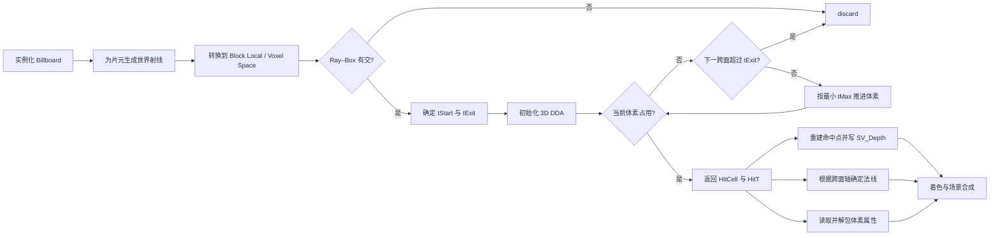
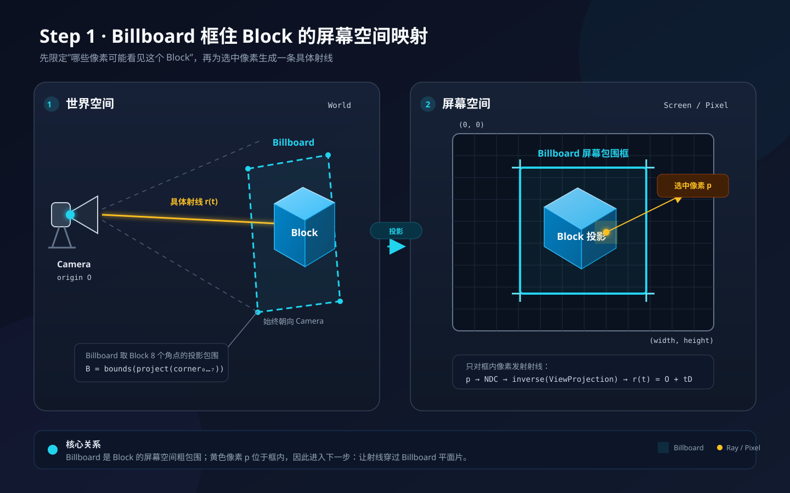
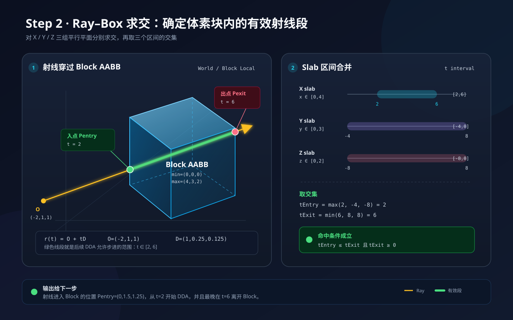
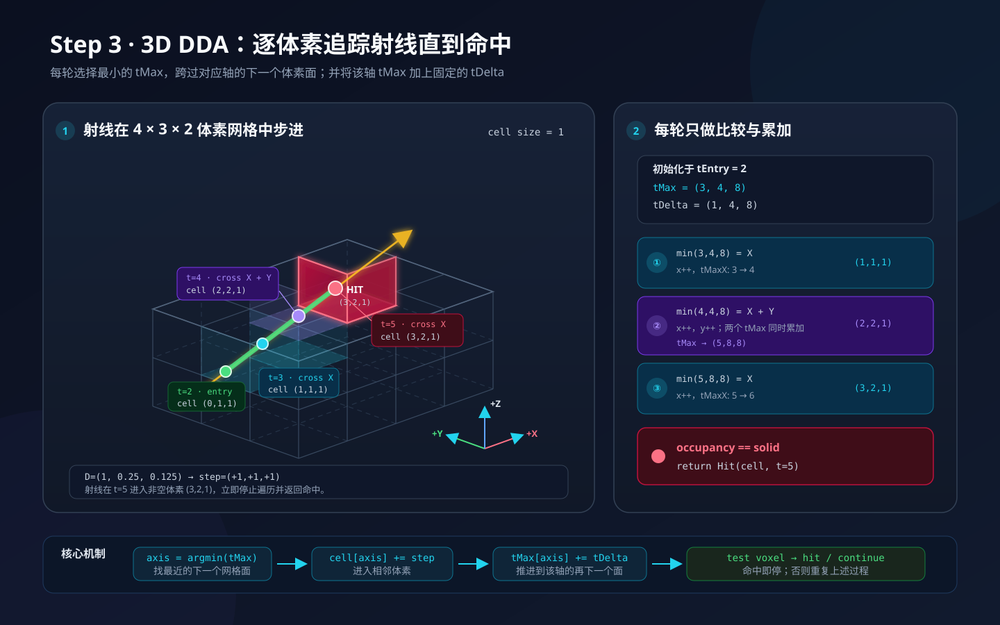
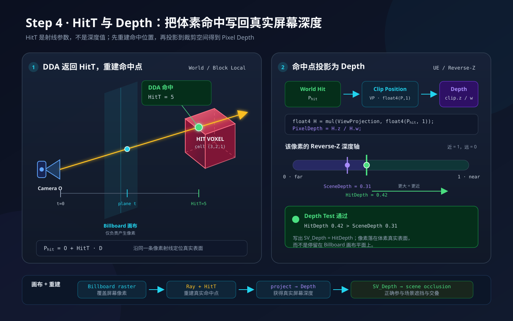
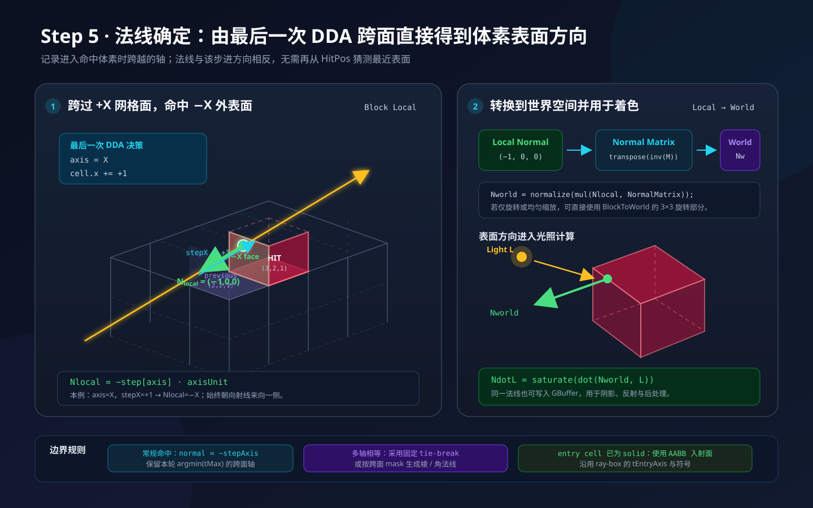
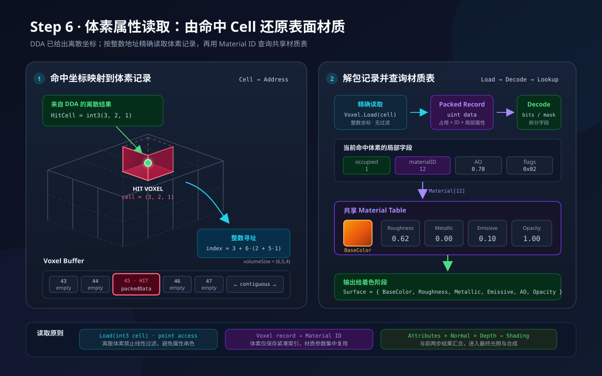
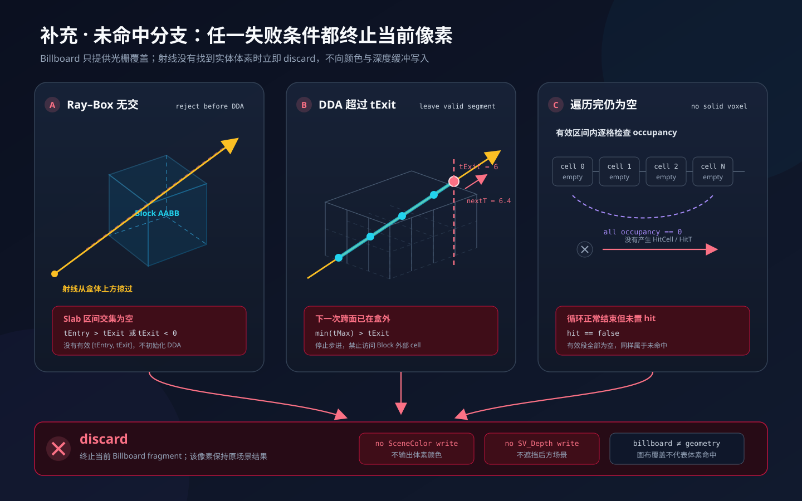
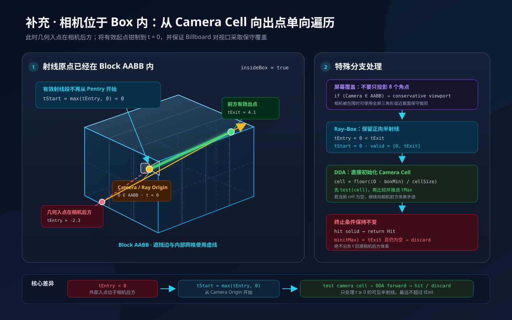
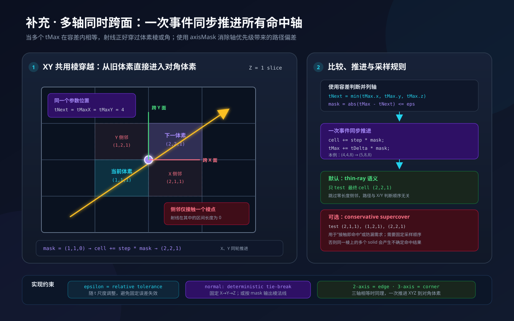

# 04 · Billboard 体素光线遍历流程

> 本文把一个体素 Block 从 Billboard 覆盖、Ray–Box 求交、3D DDA，到深度、法线和体素属性输出的过程串成完整闭环，并补充未命中、相机位于 Box 内、多轴同时跨面三类边界情况。
>
> 适用范围：UE 5.4 / 5.5，自定义 Global Shader + RDG；每个 Block 为 `4×4×4` 体素，使用 64-bit 占用掩码。

---

## 1. 总体流程



一个 Billboard 片元只有两种最终结果：

- **Hit**：输出体素颜色或 GBuffer 属性，并写入真实体素表面的 `SV_Depth`。
- **Miss**：执行 `discard`，既不写颜色，也不写深度。

---

## 2. 统一约定

### 2.1 坐标空间

本项目的体素坐标与 UE 世界坐标映射为：

```text
Voxel (x, y, z) → World (x, z, y)
```

其中体素 `Y` 为高度轴，映射到 UE 世界 `Z`。Ray–Box 和 DDA 应在同一个规则空间内计算，推荐流程为：

```hlsl
Olocal = WorldToBlockLocal(CameraWorldPosition);
Dlocal = WorldToBlockLocalDirection(WorldRayDirection);
```

若 Block 存在非均匀缩放，不应在变换后重新归一化 `Dlocal`，否则 `t` 的尺度会改变。命中世界点可以用同一参数重建：

```hlsl
Pworld = CameraWorldPosition + HitT * WorldRayDirection;
```

### 2.2 距离基准

全文约定：

- `tEntry`、`tExit`、`HitT` 都是相对射线原点的绝对参数。
- DDA 内部可以使用相对 Block 入口的局部距离 `tLocal`。
- 返回命中距离时必须执行 `HitT = tStart + tLocal`。

不要把“相对相机”和“相对 Block 入口”的距离混用，否则会导致命中点、深度和调试灰度错位。

### 2.3 Block 数据

```cpp
struct FBlockRenderData
{
    uint32 ShapeLevelAndLocation;
    uint32 ShapeMaskLow;
    uint32 ShapeMaskHigh;
    uint32 RenderStartIndex;
};

struct FVoxelRenderData
{
    uint32 PackedData; // RGB24 + material/extra8
};
```

局部体素位序：

```hlsl
HitBit = x | (y << 2) | (z << 4); // x 最快，随后 y、z
```

---

## 3. Step 1：Billboard 屏幕覆盖与射线生成



每个 Block 只提交一个 4 顶点 Billboard。顶点着色器根据 `SV_InstanceID` 读取 Block 数据、重建 AABB，并沿相机 `Right/Up` 展开面片，使它保守覆盖 Block 的屏幕投影。

片元着色器根据当前像素生成世界空间射线：

```hlsl
RayOrigin = CameraWorldPosition;
RayDirection = normalize(UnprojectPixelToWorld(pixel) - RayOrigin);
```

Billboard 只是粗覆盖代理。片元落在 Billboard 上，不代表射线一定命中 Block，更不代表命中有效体素。

实现要求：

- Billboard 必须覆盖 Block 最近角点的透视投影，避免边缘漏像素。
- 面片过大会增加 overdraw，过小会产生接缝和颜色穿透。
- 相机位于 AABB 内时不能只依赖 8 个角点的普通投影，需走保守覆盖分支。

---

## 4. Step 2：Ray–Box 求交



使用 Slab 法分别计算射线与 X、Y、Z 三组平行面的交点区间：

```hlsl
float3 t0 = (BoxMin - Olocal) / Dlocal;
float3 t1 = (BoxMax - Olocal) / Dlocal;
float3 tNear = min(t0, t1);
float3 tFar  = max(t0, t1);

float tEntry = max(tNear.x, max(tNear.y, tNear.z));
float tExit  = min(tFar.x,  min(tFar.y,  tFar.z));
```

有效条件：

```hlsl
bool intersects = (tEntry <= tExit) && (tExit >= 0.0);
```

有效遍历区间为：

```hlsl
float tStart = max(tEntry, 0.0);
```

当某个方向分量接近 0 时，应按平行 Slab 单独处理，避免除以零：原点不在该轴区间内则直接 Miss；在区间内则该轴不限制交集。

---

## 5. Step 3：3D DDA 逐体素步进



从 `Pstart = Olocal + tStart * Dlocal` 确定初始体素：

```hlsl
int3 cell = clamp(floor((Pstart - BoxMin) / CellSize), 0, GridSize - 1);
int3 step = sign(Dlocal);
```

随后计算：

- `tMax`：从当前点到各轴下一个体素面的参数距离。
- `tDelta`：射线沿各轴跨过一个完整体素所需的固定参数增量。

每轮先检查当前体素占用；为空时选择最小的 `tMax`，跨入下一个体素，并把对应轴的 `tMax` 加上 `tDelta`。

```hlsl
while (true)
{
    if (IsOccupied(cell))
    {
        HitCell = cell;
        HitT = tStart + tCurrent;
        break;
    }

    float tNext = min(tMax.x, min(tMax.y, tMax.z));
    if (tStart + tNext > tExit)
        discard;

    bool3 axisMask = abs(tMax - tNext) <= epsilon;
    cell += step * int3(axisMask);
    tMax += tDelta * float3(axisMask);
    tCurrent = tNext;
}
```

关键约束：

- 初始体素必须先检测，再执行第一次步进。
- `tCurrent` 若相对 `tStart` 计量，应从 `0` 开始。
- 下一跨面超过 `tExit` 时立即停止，禁止读取 Block 外体素。
- 访问 Occupancy 前应保证 `cell` 位于合法范围。

---

## 6. Step 4：HitT、命中点与真实深度



DDA 返回 `HitT` 后，在世界空间重建真实命中点：

```hlsl
float3 PHitWorld = CameraWorldPosition + HitT * WorldRayDirection;
float4 HitClip = mul(float4(PHitWorld, 1.0), ViewProjectionMatrix);
float Depth = HitClip.z / HitClip.w;
```

片元输出真实深度而不是 Billboard 平面的深度：

```hlsl
Output.Depth = Depth; // SV_Depth
```

本项目使用 UE Reverse-Z：

- 近处深度接近 `1`，远处深度接近 `0`。
- 深度清除值为 Far，即 `0`。
- 深度比较使用 `NearOrEqual`，对应 `GreaterEqual` 语义。

只有命中路径才能写 `SV_Depth`。Miss 路径必须 `discard`，否则透明或空体素区域仍会错误遮挡后方场景。

---

## 7. Step 5：确定命中法线



普通单轴跨面时，进入体素的局部法线为：

```hlsl
Nlocal = -step[axis] * AxisUnit(axis);
```

例如射线沿 `+X` 跨入命中体素，则命中的是该体素的 `-X` 面，法线为 `(-1,0,0)`。

法线随后转换到世界空间：

```hlsl
Nworld = normalize(TransformNormalBlockLocalToWorld(Nlocal));
```

实现注意：

- 若初始体素立即命中，法线应来自 Ray–Box 的进入面。
- 若 Block 存在非均匀缩放，应使用逆转置矩阵变换法线。
- 多轴同时跨面时几何法线不唯一，需采用稳定的 tie-break 或明确输出棱/角法线。
- 世界法线可用于 `N·L`、AO、GBuffer 和阴影计算。

---

## 8. Step 6：读取体素属性



命中 `HitCell` 后，先计算其 64-bit 占用位：

```hlsl
uint HitBit = HitCell.x | (HitCell.y << 2) | (HitCell.z << 4);
```

本项目只为占用体素存储属性，因此不能直接用 `HitBit` 索引 `VoxelRenderData`。需要统计命中位之前的已占用体素数：

```hlsl
uint Offset = PopCountBelow64(HitBit, ShapeMaskLow, ShapeMaskHigh);
uint ColorIndex = RenderStartIndex + Offset;
uint PackedData = VoxelRenderDataBuffer[ColorIndex];
```

解包属性：

```hlsl
float3 BaseColor = float3(
    PackedData & 0xFF,
    (PackedData >> 8) & 0xFF,
    (PackedData >> 16) & 0xFF
) / 255.0;

uint MaterialOrExtra = (PackedData >> 24) & 0xFF;
```

数据访问必须采用整数坐标、无过滤的精确读取。CPU 生成 `VoxelData[]` 的顺序必须与 `HitBit` 位序一致，否则颜色和材质会映射到错误体素。

最终着色输入至少包含：

```text
PHitWorld + Nworld + BaseColor + MaterialOrExtra + Depth
```

---

## 9. 补充：未命中分支



以下三种路径都必须执行 `discard`：

1. **Ray–Box 无交**：`tEntry > tExit` 或 `tExit < 0`。
2. **DDA 超过 `tExit`**：下一次跨面已经位于 Block 外。
3. **有效区间遍历完仍为空**：所有访问体素的 Occupancy 都为 `0`。

`discard` 的结果是：

- 不写 SceneColor 或 GBuffer。
- 不写 `SV_Depth`。
- Billboard 空白区域不会遮挡后方场景。

---

## 10. 补充：相机位于 Box 内



相机在 AABB 内时通常有：

```text
tEntry < 0 < tExit
```

处理规则：

```hlsl
tStart = max(tEntry, 0.0); // 结果为 0
cell = floor((Olocal - BoxMin) / CellSize);
```

从 Camera Cell 开始先检测当前体素，再只沿 `t >= 0` 的相机前方执行 DDA，绝不回溯负 `t` 区间。

屏幕覆盖也要切换为保守策略。相机被 Box 包围时，简单投影 8 个角点可能无法形成正确的 Billboard 包围，可使用全屏三角形或按近裁面生成保守覆盖。

若相机所在体素本身为实心，需要由产品语义决定：立即命中、跳过当前体素，或对近距离体素执行淡出/缩小。该规则应显式配置，不能依赖未初始化法线。

---

## 11. 补充：多轴同时跨面



当多个 `tMax` 在容差内相等时，射线正好穿过体素棱或角：

```hlsl
float tNext = min(tMax.x, min(tMax.y, tMax.z));
bool3 axisMask = abs(tMax - tNext) <= epsilon;

cell += step * int3(axisMask);
tMax += tDelta * float3(axisMask);
```

本例在 `t=4` 时：

```text
tMax = (4,4,8)
axisMask = (1,1,0)
cell: (1,1,1) → (2,2,1)
tMax: (4,4,8) → (5,8,8)
```

推荐默认采用 **thin-ray** 语义：一次推进所有并列轴，只检测最终进入的对角体素。仅接触棱点、区间长度为零的侧邻体素不参与命中。

如业务要求“接触即命中”，可采用 **conservative supercover**，额外检测所有被棱或角接触的邻居，但必须定义固定检测顺序，否则多个相邻实心体素会产生不确定结果。

容差应随 `tNext` 的数值尺度调整，例如：

```hlsl
float epsilon = 1e-6 * max(1.0, abs(tNext));
```

法线策略也必须稳定：可以固定 `X → Y → Z` 优先级选一个面法线，或根据 `axisMask` 构造并归一化棱/角法线。

---

## 12. 完整片元流程伪代码

```hlsl
PixelOutput TraceVoxelBlock(PixelInput input)
{
    Ray rayWorld = BuildCameraRay(input.PixelPosition);
    Ray rayLocal = TransformRayToBlockLocal(rayWorld);

    float tEntry;
    float tExit;
    float3 entryNormal;
    if (!IntersectAABB(rayLocal, BoxMin, BoxMax, tEntry, tExit, entryNormal))
        discard;

    float tStart = max(tEntry, 0.0);
    DDAState dda = InitDDA(rayLocal, tStart, BoxMin, CellSize);

    bool hit = false;
    int3 hitCell = 0;
    float hitT = 0.0;
    float3 hitNormalLocal = 0.0;

    while (IsInsideGrid(dda.Cell))
    {
        if (IsOccupied(dda.Cell))
        {
            hit = true;
            hitCell = dda.Cell;
            hitT = tStart + dda.TCurrent;
            hitNormalLocal = dda.HasStepped ? dda.EntryNormal : entryNormal;
            break;
        }

        float tNext = Min3(dda.TMax);
        if (tStart + tNext > tExit)
            break;

        float epsilon = 1e-6 * max(1.0, abs(tNext));
        bool3 axisMask = abs(dda.TMax - tNext) <= epsilon;

        dda.Cell += dda.Step * int3(axisMask);
        dda.TMax += dda.TDelta * float3(axisMask);
        dda.TCurrent = tNext;
        dda.EntryNormal = ResolveNormal(axisMask, dda.Step);
        dda.HasStepped = true;
    }

    if (!hit)
        discard;

    float3 hitWorld = rayWorld.Origin + hitT * rayWorld.Direction;
    float3 normalWorld = TransformNormalToWorld(hitNormalLocal);
    VoxelAttributes attr = FetchVoxelAttributes(hitCell);

    PixelOutput output;
    output.Color = ShadeVoxel(hitWorld, normalWorld, attr);
    output.Depth = ProjectToReverseZDepth(hitWorld);
    return output;
}
```

---

## 13. 正确性检查清单

- [ ] Billboard 完整覆盖 Block 投影，边缘无漏像素。
- [ ] Ray、AABB 和 DDA 使用一致坐标空间。
- [ ] 非均匀缩放下没有错误归一化局部射线方向。
- [ ] `tEntry`、`tExit`、`HitT` 使用统一参数基准。
- [ ] 初始 Cell 在第一次步进前已执行 Occupancy 检测。
- [ ] DDA 在下一跨面超过 `tExit` 时停止。
- [ ] 多轴相等时同步推进，不依赖 `if/else` 的轴顺序。
- [ ] Miss 路径不写颜色和深度。
- [ ] 命中深度按 UE Reverse-Z 规则写入。
- [ ] 首 Cell 命中和多轴跨面都有确定法线。
- [ ] 属性索引使用 `RenderStartIndex + PopCountBelow64(...)`。
- [ ] CPU 属性写入顺序与 GPU 掩码位序完全一致。

---

## 14. 流程结论

完整闭环为：

```text
Billboard 保守覆盖
→ 为片元生成射线
→ 转换到 Block Local / Voxel Space
→ Ray–Box 限定 [tStart, tExit]
→ 3D DDA 查找首个占用体素
→ 返回 HitCell / HitT / HitNormal
→ 重建世界命中点并覆写真实深度
→ 读取压缩体素属性
→ 着色输出；所有 Miss 分支 discard
```

这套流程使一个 4 顶点 Billboard 能在片元阶段重建最多 64 个体素的真实形状，同时保持正确的遮挡、法线和材质属性。
