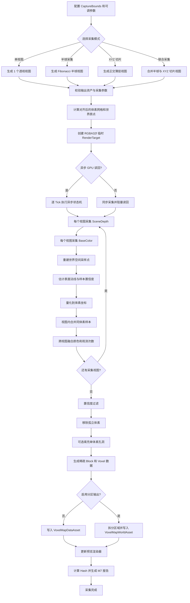
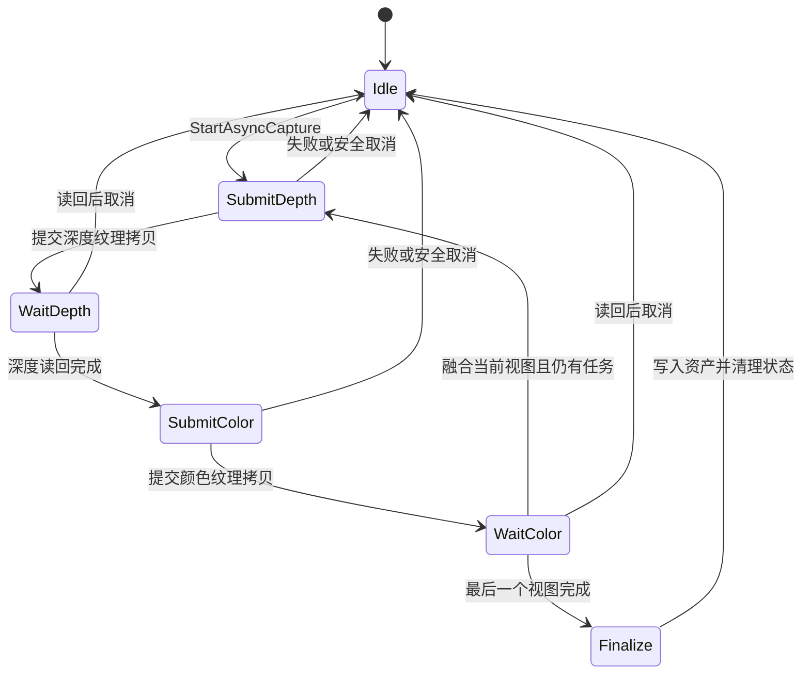

# 05 · 真实场景体素采集流程

> 本文说明 `AVoxelMapCollector` 如何把 Unreal Engine 关卡中的真实场景转换为稀疏体素数据，包括视图生成、Depth/BaseColor 采集、GPU 读回、世界坐标重建、多视图融合、后处理、资产写入和质量报告。
>
> 适用范围：UE 5.4 / 5.5；采集器为 Editor Only Actor，采集结果保存到 `UVoxelMapDataAsset` 或 `UVoxelMapWorldAsset`。

---

## 1. 总体流程



采集链路的核心目标是：

```text
场景表面像素
→ 世界空间采样点
→ 带置信度的体素观测
→ 多视图融合体素
→ 稀疏 4×4×4 Block 数据
→ 可持久化 DataAsset
```

---

## 2. 采集入口

`AVoxelMapCollector` 提供四个真实场景采集入口：

| 编辑器操作 | C++ 入口 | 视图类型 | 主要用途 |
|---|---|---|---|
| 单视图采集 | `BakeSingleViewCapture()` | 1 个透视视图 | 快速调试方向、深度和颜色 |
| 半球采集 | `BakeHemisphereCapture()` | Fibonacci 半球透视视图 | 从场景上半球覆盖外部可见表面 |
| XYZ 切片采集 | `BakeXYZSliceCapture()` | 沿 X/Y/Z 轴的正交薄层视图 | 减少大型或复杂场景的遮挡缺失 |
| 联合世界采集 | `BakeCombinedWorldCapture()` | 半球视图 + XYZ 切片 | 同时获得外部覆盖和内部薄层覆盖 |

> [!note] 程序化烘焙不是场景采集
> `BakeVoxelMap()` 和 `BakePerformanceTest()` 使用程序化地形生成器，不读取真实关卡表面，因此不进入本文描述的 Depth/BaseColor 采集流程。

当 `bUseAsyncGPUReadback = true` 时，入口转入 `StartAsyncCapture()`；否则转入同步的 `BakeCapturePasses()`。

---

## 3. 初始化与校验

开始采集前会检查：

- 当前没有其他异步采集任务运行。
- 非分区模式已设置 `OutputDataAsset`。
- 分区模式已设置 `OutputWorldAsset`。
- `CaptureBounds` 和 `CaptureComponent` 有效。
- 至少存在一个透视方向或启用了 XYZ 切片。
- `VoxelSize > 0`。
- `CaptureResolution >= 64`。

### 3.1 采集范围

采集范围来自 `CaptureBounds` 的世界包围盒：

```text
Bounds = CaptureBounds 的世界空间 AABB
```

只有位于该 AABB 内的重建采样点才会进入体素融合。

### 3.2 网格尺寸对齐

世界范围按 `VoxelSize` 转换为体素数量，并将每个轴向上对齐到 `4` 的倍数，因为一个 Block 固定包含 `4×4×4` 个体素。

本项目的坐标映射为：

```text
Voxel (X, Y, Z) → Unreal World (X, Z, Y)
```

因此网格尺寸按以下关系计算：

```text
Grid.X = ceil(Bounds.Size.X / VoxelSize)
Grid.Y = ceil(Bounds.Size.Z / VoxelSize)
Grid.Z = ceil(Bounds.Size.Y / VoxelSize)
```

网格原点以对齐后的网格尺寸为准，并围绕 `CaptureBounds` 中心放置。这样即使范围尺寸不能被 `VoxelSize × 4` 整除，网格仍保持居中。

### 3.3 Block 地址限制

总 Block 数必须满足：

```text
TotalBlocks = Grid.X/4 × Grid.Y/4 × Grid.Z/4
TotalBlocks <= 0x00FFFFFF
```

Block 线性索引使用 24 bit 存储，超出限制会直接终止采集。

---

## 4. 采集视图生成

### 4.1 单视图

`SingleViewDirection` 归一化后作为相机相对采集中心的方向。若方向接近零，则使用默认方向：

```text
normalize(1, -1, 1)
```

相机位于包围球外侧并朝向 `CaptureBounds` 中心。距离根据包围球半径和视场角计算，以保证采集范围完整进入视锥。

### 4.2 Fibonacci 半球

半球采集根据 `HemisphereViewCount` 使用黄金角生成均匀方向：

```text
GoldenAngle = π × (3 - √5)
Z           = (Index + 0.5) / ViewCount
Radius      = √(1 - Z²)
Azimuth     = GoldenAngle × Index
Direction   = (Radius×cos(Azimuth), Radius×sin(Azimuth), Z)
```

所有方向的世界 `Z` 均为正，因此相机分布在采集范围的上半球。

### 4.3 XYZ 正交切片

切片厚度为：

```text
SlabThickness = max(1, SliceThicknessInVoxels) × VoxelSize
```

启用的每个世界轴会被拆分为若干薄层。每层生成一个正交视图；若启用双向采集，则从轴正向和反向各采集一次。

每个切片任务记录：

- 所属世界轴 `SlabAxis`。
- 薄层最小坐标 `SlabMin`。
- 薄层最大坐标 `SlabMax`。
- 相机位置和旋转。
- 正交投影宽度 `OrthoWidth`。

世界坐标重建后还会再次检查采样点是否落在当前薄层内，避免其他深度表面污染该切片。

---

## 5. Depth 与 BaseColor 采集

每个视图都执行两次 `SceneCaptureComponent2D` 渲染：

1. 使用 `SCS_SceneDepth` 采集线性场景深度。
2. 使用 `SCS_BaseColor` 采集不含光照的基础颜色。

临时纹理为：

```text
尺寸：CaptureResolution × CaptureResolution
格式：RTF_RGBA32f
生命周期：Transient，不保存到资产
```

Depth 和 BaseColor 必须具有相同的像素数量，否则该视图融合失败。

### 5.1 异步读回

异步路径使用 `FRHIGPUTextureReadback`：



`Tick()` 每帧调用 `AdvanceAsyncCapture()`，只在 GPU 数据准备好后继续下一阶段，因此不会像同步读回那样长时间阻塞编辑器线程。

取消操作只设置 `bAsyncCancelRequested`。若 GPU 读回正在进行，系统会等待当前读回到达安全点，再释放对象并结束任务。

### 5.2 同步读回

同步路径在采集后调用 `FlushRenderingCommands()` 和 `ReadLinearColorPixels()`：

```text
采集 Depth
→ Flush
→ 读取 Depth
→ 采集 BaseColor
→ Flush
→ 读取 BaseColor
```

该路径实现简单，但高分辨率、多视图采集时会明显阻塞编辑器。

---

## 6. 像素到世界空间

每个像素首先读取 `SceneDepth`。以下情况会立即丢弃：

- 深度不是有限数值。
- 深度小于 `MinimumCaptureDepth`。
- 深度超过根据采集范围推导的最大有效深度。
- 重建点不在 `CaptureBounds` 内。
- 切片模式下，重建点不在当前薄层内。

### 6.1 透视重建

根据像素中心计算归一化屏幕坐标，再由相机的 Forward、Right、Up 和 FOV 构造射线方向：

```text
RayDirection = normalize(
    Forward
    + Right × NormalizedX × tan(FOV/2)
    + Up    × NormalizedY × tan(FOV/2)
)
```

`SceneDepth` 是沿相机 Forward 方向的深度，因此需要除以射线在 Forward 上的投影：

```text
WorldPosition = CameraPosition
              + RayDirection × SceneDepth / dot(RayDirection, Forward)
```

### 6.2 正交重建

正交视图中所有像素共用 `Forward`：

```text
WorldPosition = CameraPosition
              + Forward × SceneDepth
              + Right × ScreenX × OrthoWidth/2
              + Up    × ScreenY × OrthoWidth/2
```

---

## 7. 表面置信度

系统使用当前像素、水平邻居和垂直邻居估计表面法线。优先读取右侧和下侧邻居，越界或无效时回退到左侧和上侧。

邻居深度差必须小于：

```text
DepthThreshold = DepthDiscontinuityThresholdInVoxels × VoxelSize
```

满足条件后计算：

```text
Normal     = normalize(cross(HorizontalPosition - Center,
                             VerticalPosition - Center))
Facing     = abs(dot(Normal, -ViewDirection))
EdgePenalty = 1 - max(HorizontalDepthDelta, VerticalDepthDelta) / DepthThreshold
Confidence = Facing × clamp(EdgePenalty, 0, 1)
```

该置信度同时抑制：

- 掠射角样本。
- 轮廓边缘的深度突变。
- 邻域不连续导致的错误法线。

无法可靠计算邻域法线时使用基础置信度 `0.25`。最终低于 `MinimumSampleConfidence` 的样本会被丢弃。

---

## 8. 体素量化与多视图融合

### 8.1 世界坐标转体素坐标

```text
Relative = (WorldPosition - WorldOrigin) / VoxelSize

Voxel.X = floor(Relative.X)
Voxel.Y = floor(Relative.Z)
Voxel.Z = floor(Relative.Y)
```

量化后还会检查坐标是否位于网格范围内。

系统同时计算采样点到体素中心的距离，用于 M7 量化误差报告：

```text
QuantizationError = distance(WorldPosition, VoxelCenter)
```

### 8.2 视图内融合

同一个视图内，多个像素可能落到同一体素。系统先写入 `FViewVoxelAccumulator`：

```text
WeightedColor += BaseColor × Confidence
TotalWeight   += Confidence
MaximumConfidence = max(MaximumConfidence, Confidence)
```

同一视图内无论有多少像素命中同一体素，最终只贡献一次独立观测计数。

### 8.3 跨视图融合

每个视图结束后，将视图平均颜色合并到全局 `FCaptureAccumulator`：

```text
ViewAverage = ViewWeightedColor / ViewTotalWeight
ViewWeight  = max(ViewMaximumConfidence, MinimumSampleConfidence)

GlobalWeightedColor += ViewAverage × ViewWeight
GlobalTotalWeight   += ViewWeight
GlobalMaximumConfidence = max(GlobalMaximumConfidence, ViewMaximumConfidence)
GlobalObservationCount += 1
```

这种两级融合避免高分辨率视图因为命中像素更多而压倒其他视图。

---

## 9. 后处理

所有视图完成后，`FinalizeCapturedVoxels()` 依次执行以下处理。

### 9.1 置信度过滤

体素满足以下任一条件即可保留：

```text
ObservationCount >= MinimumObservationCount
或
MaximumConfidence >= HighConfidenceThreshold
```

总权重无效的体素始终删除。高置信度条件允许正视表面的单次可靠观测绕过最少观测数限制。

### 9.2 移除孤立体素

启用 `bRemoveIsolatedVoxels` 后，系统检查完整 `3×3×3` 邻域中的 26 个相邻位置。

若占用邻居少于 `MinimumOccupiedNeighborCount`，该体素会被删除。默认值 `1` 只移除完全孤立的飞点。

### 9.3 填充单体素孔洞

启用 `bFillSingleVoxelHoles` 后，系统检查空位置在 X、Y、Z 三个轴上是否同时拥有成对的相对邻居。

当满足的轴数不少于 `FillHoleRequiredOpposingAxes` 时：

- 使用最多 6 个轴向邻居的平均颜色填充。
- 将填充体素的置信度设为高置信度阈值。
- 将观测次数设为最少观测数。

该步骤默认关闭，以优先保持原始场景拓扑。

---

## 10. 稀疏数据构建

后处理后的每个体素首先计算置信度加权平均颜色，并转换到 sRGB：

```text
AverageColor = WeightedLinearColorSum / TotalWeight
PackedData   = R | G<<8 | B<<16 | Extra<<24
```

当前采集流程将 `Extra` 写为 `0`。

`FVoxelMapDataBuilder` 再将源体素组织为稀疏 `4×4×4` Block：

```text
每个 Block：
- 8 bit  2×2×2 粗占用掩码
- 24 bit Block 线性索引
- 64 bit 4×4×4 精细占用掩码
- 32 bit VoxelData 起始索引

每个占用体素：
- 32 bit RGB24 + Extra8
```

同一 Block 内的体素按局部位索引排序，重复坐标以后写入的数据为准。空 Block 不进入最终 `BlockData`。

---

## 11. 资产输出

### 11.1 单资产模式

当 `bWritePartitionedWorldAsset = false` 时：

```text
SourceVoxels
→ FVoxelMapDataBuilder::Build
→ FVoxelMapGenerator::Validate
→ CommitDataAsset
→ OutputDataAsset
```

写入内容包括：

- 稀疏体素数据。
- `VoxelSize`。
- 世界原点和网格尺寸。
- 采集包围盒。
- 采集视图数。
- 源关卡包名。
- 数据版本号 `5`。

资产会被标记为 Dirty，需要在编辑器中保存。

### 11.2 分区世界模式

当 `bWritePartitionedWorldAsset = true` 时，体素按对齐后的 `RegionSizeInVoxels` 分组：

```text
RegionCoordinate = VoxelCoordinate / AlignedRegionSize
LocalCoordinate  = VoxelCoordinate - RegionCoordinate × AlignedRegionSize
```

每个非空区域生成或更新独立的 `UVoxelMapDataAsset`，默认位置为：

```text
<WorldAsset 所在目录>/Regions/
<WorldAssetName>_R_X_Y_Z
```

`OutputWorldAsset` 保存区域坐标、世界包围盒和区域资产引用。区域按 `Z → Y → X` 排序，以保证稳定输出。

### 11.3 预览刷新

若设置了 `PreviewRenderer`：

- 单资产模式将 `VoxelMapAsset` 指向 `OutputDataAsset`。
- 分区模式将 `VoxelMapWorldAsset` 指向 `OutputWorldAsset`。
- 随后调用 `ReloadVoxelMapAsset()` 立即刷新预览。

---

## 12. M7 质量报告

资产提交后生成 `FVoxelMapBakeReport`，主要指标包括：

- 总耗时、采集读回耗时、融合耗时、过滤耗时和构建提交耗时。
- 网格尺寸和采集视图数量。
- 候选体素、置信度拒绝数、孤立体素删除数和孔洞填充数。
- 非空 Block 数、占用体素数和数据体积。
- 已观测候选体素保留率。
- 平均及最大量化误差。
- 当前数据 SHA-1 Hash。
- 与上一次烘焙 Hash 的确定性比较结果。
- 数据有效性、覆盖率、位置误差和总体是否通过。

若启用 `bWriteM7ReportFile`，JSON 报告写入：

```text
Saved/VoxelMapReports/<BakeLabel>_<UTC Timestamp>.json
```

总体通过条件为：

```text
数据有效
且 保留率达到 MinimumObservedCoveragePercent
且 平均量化误差不超过 MaximumMeanQuantizationErrorInVoxels
且 如果存在上次 Hash，则本次 Hash 必须一致
```

---

## 13. 关键可调参数

| 中文显示名 | C++ 变量 | 影响阶段 |
|---|---|---|
| 输出体素资产 | `OutputDataAsset` | 单资产输出目标 |
| 输出世界资产 | `OutputWorldAsset` | 分区输出目标 |
| 启用分区输出 | `bWritePartitionedWorldAsset` | 选择资产提交分支 |
| 区域体素尺寸 | `RegionSizeInVoxels` | 分区粒度 |
| 预览渲染器 | `PreviewRenderer` | 完成后自动刷新 |
| 体素边长（厘米） | `VoxelSize` | 网格精度、数据规模和量化误差 |
| 单视图方向 | `SingleViewDirection` | 单视图相机方向 |
| 透视视场角 | `CaptureFieldOfView` | 透视覆盖范围和相机距离 |
| 采集分辨率 | `CaptureResolution` | GPU 渲染、读回和融合成本 |
| 半球视图数量 | `HemisphereViewCount` | 半球覆盖率和采集耗时 |
| 切片厚度（体素） | `SliceThicknessInVoxels` | 切片数量和遮挡控制 |
| 双向采集切片 | `bCaptureSlicesFromBothDirections` | 是否覆盖相反朝向表面 |
| 采集 X/Y/Z 轴切片 | `bCaptureSliceAxisX/Y/Z` | 启用的切片轴 |
| 最小有效深度（厘米） | `MinimumCaptureDepth` | 近距离无效样本过滤 |
| 深度突变阈值（体素） | `DepthDiscontinuityThresholdInVoxels` | 法线估计和轮廓抑制 |
| 最少独立观测数 | `MinimumObservationCount` | 多视图可靠性过滤 |
| 高置信度阈值 | `HighConfidenceThreshold` | 单次可靠观测保留 |
| 最低样本置信度 | `MinimumSampleConfidence` | 掠射样本过滤 |
| 移除孤立体素 | `bRemoveIsolatedVoxels` | 飞点清理 |
| 最少邻居数量 | `MinimumOccupiedNeighborCount` | 孤立体素判定强度 |
| 填充单体素孔洞 | `bFillSingleVoxelHoles` | 是否执行保守补洞 |
| 补洞所需对向轴数 | `FillHoleRequiredOpposingAxes` | 补洞严格程度 |
| 使用异步 GPU 读回 | `bUseAsyncGPUReadback` | 异步或同步采集路径 |
| 最低观测保留率（%） | `MinimumObservedCoveragePercent` | M7 覆盖率验收 |
| 最大平均量化误差（体素） | `MaximumMeanQuantizationErrorInVoxels` | M7 位置误差验收 |
| 写入 M7 报告文件 | `bWriteM7ReportFile` | 是否输出 JSON 报告 |

---

## 14. 推荐操作顺序

1. 在关卡中放置 `VoxelMapCollector`。
2. 调整 `CaptureBounds`，完整覆盖需要体素化的场景。
3. 设置 `VoxelSize` 和 `CaptureResolution`。
4. 选择 `OutputDataAsset`，或启用分区并设置 `OutputWorldAsset`。
5. 先运行单视图采集，验证深度、颜色和坐标方向。
6. 再运行半球采集，检查外部表面覆盖。
7. 对遮挡严重或含内部结构的场景运行 XYZ 切片或联合采集。
8. 根据报告调整最少观测数、置信度、孤立体素和补洞参数。
9. 检查 `LastBakeReport` 和 `Saved/VoxelMapReports`。
10. 保存被标记为 Dirty 的输出资产。

> [!warning] 性能提示
> `CaptureResolution`、半球视图数量和切片数量会近似乘法放大总工作量。通常应先增大 `VoxelSize`、减少视图并使用较低分辨率完成链路验证，再逐步提高质量。

---

## 15. 代码定位

主要实现位于：

- `Source/DS2VoxelMap/VoxelMapCollector.h`：可调参数、采集状态和函数声明。
- `Source/DS2VoxelMap/VoxelMapCollector.cpp`：视图构造、GPU 读回、像素融合、过滤、资产提交和报告。
- `Source/DS2VoxelMap/VoxelMapDataBuilder.cpp`：源体素到稀疏 Block 数据的构建。
- `Source/DS2VoxelMap/VoxelMapTypes.h`：Block、占用掩码和体素颜色的位布局。
- `Source/DS2VoxelMap/VoxelMapBakeReport.h`：M7 质量报告字段。
